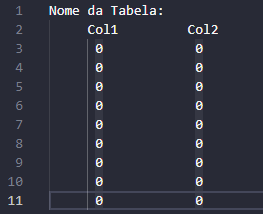

# Table Analyser

## Introdução

Esse é um código utilizado para analisar tabelas de modo gráfico `graph_plot.py`
e também para retornar uma descrição dos dados em formato excel `data_describe.py`.

## Como usar

### Python
Para utilizar basta instalar o Python3 com as bibliotecas
nesse caso basta utilizar o comando na pasta do github 

```
pip install -r requirements.txt
```

### Anaconda
Outra possibilidade é instalar o Anaconda que já possui todas as bibliotecas
necessárias para execução do código.

As tabelas devem ser colocadas na pasta dados e devem seguir como na imagem:



Devem ter quantas colunas necessárias separadas por 8 espaços entre cada. </br>
A primeira linha deve conter o título da tabela, ou estar vazia.
Não devem haver outras linhas vazias, mesmo no final do arquivo.
